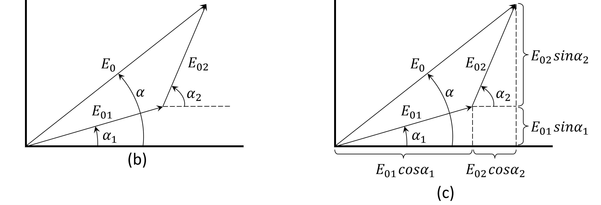
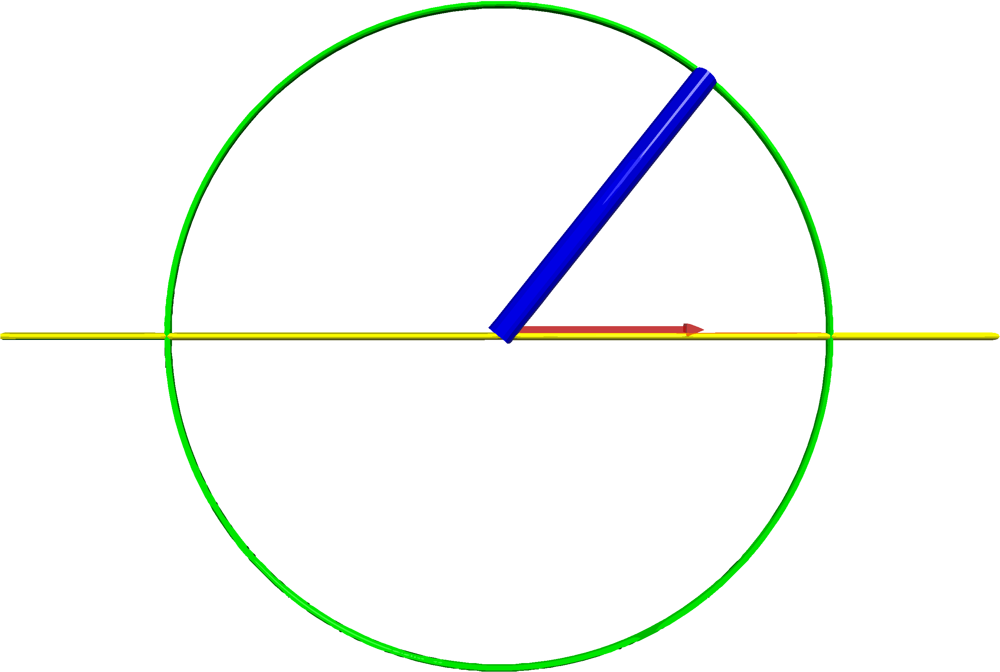
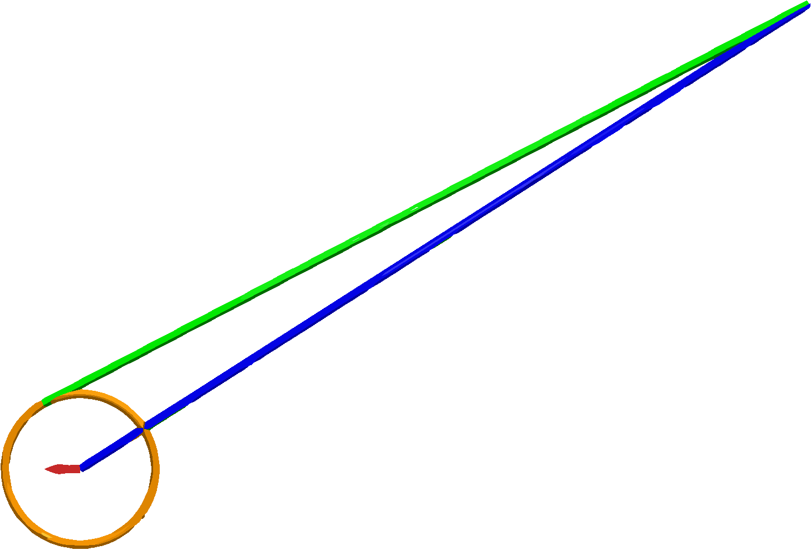
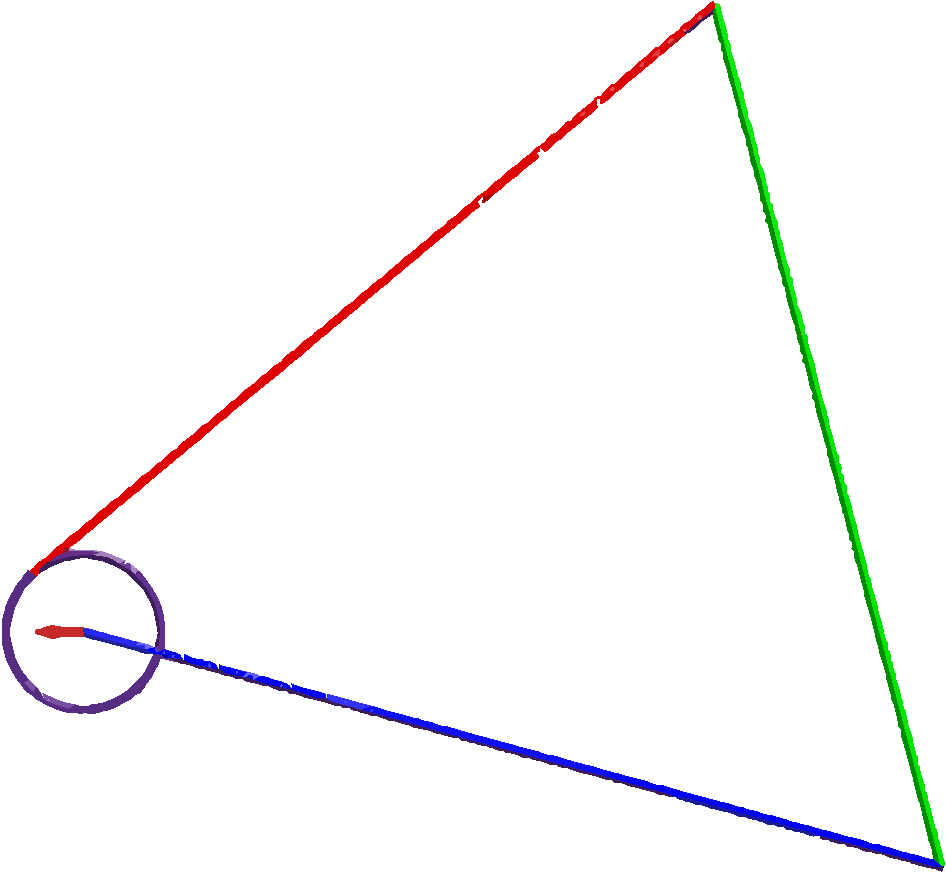

# vpython

This project visualizes phasor diagrams for one-wave, two-wave, and three-wave superpositions using VPython.  
The animation demonstrates how rotating vectors (phasors) behave in space and how their **maximum projection** determines the amplitude of the resulting interference.

本專案使用 VPython 模擬單一波、兩波與三波的向量圖（phasor diagram），  
**展示向量在空間中旋轉時的最大投影**，對應於干涉後振幅的物理意義。

---

## 📐 Phasor Principle Diagram | 向量原理圖

When multiple sinusoidal waves with the same frequency but different phases are added,  
each wave can be represented as a rotating vector (phasor) in space.  
The superposition of these phasors yields a resultant vector, whose **maximum projection** determines the net amplitude.

當多個**頻率相同、相位不同**的弦波疊加時，  
每一個波可視為空間中的一個旋轉向量（phasor）。  
其總和為這些向量的向量加總，其**最大投影**對應於干涉後的總振幅。  
此圖展示了向量合成的原理。

---

## 🧭 Scripts and Outputs | 程式與執行結果對應

| Script Name       | Description (English)                        | 中文說明                       | Screenshot           |
|------------------|----------------------------------------------|-------------------------------|-----------------------|
| `one_rod_A.py`    | One-wave phasor: a single rotating vector    | 單一波動對應一旋轉向量         |        |
| `two_rod_B.py`    | Two-wave phasor: vector sum of two waves     | 兩波向量合成動畫               |        |
| `three_rod_B.py`  | Three-wave phasor: sum of three vectors      | 三波向量合成動畫               |    |

